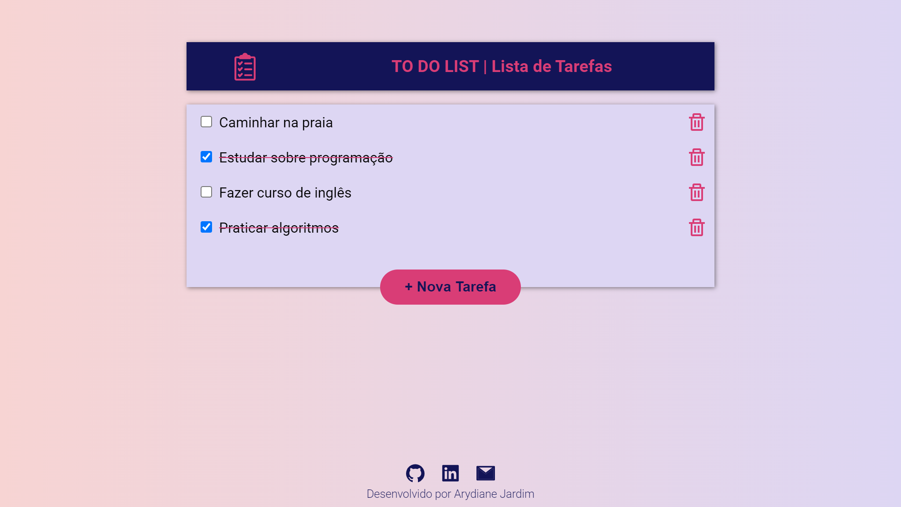
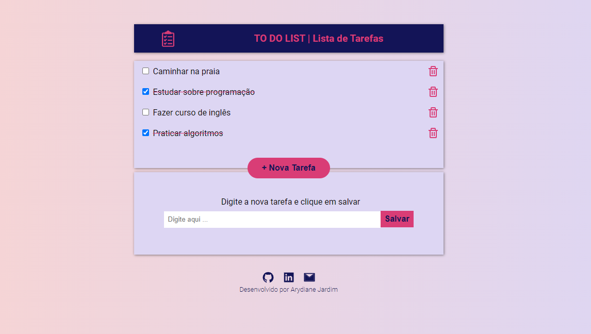
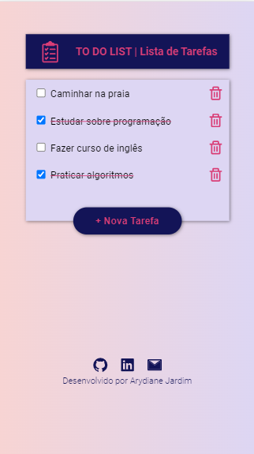
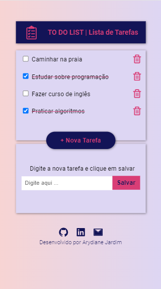

# Projeto TO DO LIST 

To Do List é um site para organizar as suas listas de tarefas. Possui as seguintes funcionalidades: adicionar uma nova tarefa, marcar como concluída e excluir. 

<strong>O objetivo do projeto é praticar os seguintes conceitos:</strong> 

- Implementar componentes com estado
- Componentes Controlados
- Utilizar o CSS modules
- Absolute imports
- Salvar dados no local Storage
- Utilizar o hook useEffect

## 💻 Layout  

### Web

  
  

### Mobile

  
  

 ## 🔧 Tecnologias 

As tecnologias usadas foram: 
* React
* JavaScript

## 🛠️ Abrir e rodar o projeto
Para abrir e rodar o projeto, execute npm i para instalar as dependências e npm start para inicar o projeto.

Depois, acesse http://localhost:3000/ no seu navegador.
